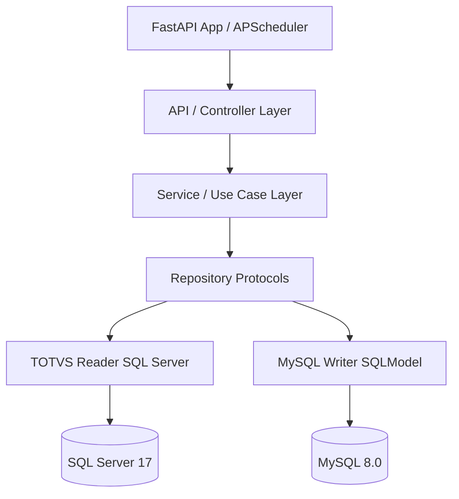

# ⚡ Solutis Sync

> Serviço assíncrono de alto desempenho para sincronização periódica de dados entre o **TOTVS (SQL Server 17)** e o banco de dados **MySQL 8.0** da Solutis.

---

## 📋 Sobre o Projeto

O **Solutis Sync** é um microsserviço desenvolvido com o ecossistema moderno do Python (**FastAPI**, **SQLModel**, **APScheduler** e **uv**). O seu propósito principal é sincronizar registros de colaboradores e ativos (patrimônio) originados do ERP TOTVS (ambiente SQL Server de leitura dedicada) para um banco de dados MySQL de forma totalmente assíncrona, robusta e resiliente.

O serviço foi desenhado para rodar em segundo plano de forma agendada (via expressões cron), sem dependências pesadas de mensageria (como RabbitMQ ou Celery), mantendo um consumo enxuto de recursos.

---

## 🏗️ Arquitetura e Padrões de Design

O projeto segue princípios de **Clean Architecture** e **Domain-Driven Design (DDD)** simplificado, garantindo desacoplamento entre banco de dados, lógica de negócio e transporte (API).



### Destaques Tecnológicos:
1. **Asincronia Ponta a Ponta ("Async All The Way")**: Todos os fluxos de I/O são assíncronos. A leitura no SQL Server utiliza o driver `aioodbc` e a gravação no MySQL utiliza a extensão assíncrona do `SQLModel`/`SQLAlchemy`.
2. **Concorrência Otimizada**: Durante a sincronização de tabelas auxiliares (lookups), o serviço utiliza `asyncio.TaskGroup` para paralelizar as requisições ao SQL Server, reduzindo drasticamente o tempo total do pipeline.
3. **Idempotência por Checksum (MD5)**: Para evitar updates desnecessários que degradam a performance do banco de dados, o repositório calcula o checksum MD5 dos dados de entrada (`core/checksums.py`) e os compara com o checksum local antes de executar a instrução SQL de `UPSERT`.
4. **Remoção de Ativos Órfãos**: Além de espelhar as inserções e atualizações, o serviço possui um caso de uso específico (`DeleteOrphanAssetsUseCase`) que identifica ativos excluídos no sistema TOTVS e realiza a limpeza lógica/física dos registros correspondentes no MySQL.
5. **Auditoria e Monitoramento**: Cada ciclo de sincronização de entidade registra métricas de auditoria na tabela `syncs_totvs`, armazenando o número de registros alterados/inseridos e o tempo de execução em milissegundos.

---

## 📂 Estrutura de Pastas

A estrutura modular garante a separação estrita de responsabilidades:

```text
solutis-sync/
├── .github/                 # Workflows de CI/CD (GitHub Actions)
├── .agents/                 # Recursos e skills auxiliares para desenvolvimento
├── src/                     # Código-fonte principal do serviço
│   ├── main.py              # Ponto de entrada do FastAPI e inicialização do ciclo de vida (Lifespan)
│   ├── api/                 # Endpoints HTTP e Injeção de Dependências
│   │   ├── deps.py          # Provedores de instâncias (Dependency Injection)
│   │   └── routes.py        # Rotas da API (ex: healthcheck, manual sync)
│   ├── core/                # Configurações do sistema e inicializações de infraestrutura
│   │   ├── checksums.py     # Lógica de cálculo de checksums de entidades
│   │   ├── config.py        # Gestão de configurações e validações baseadas em Pydantic Settings
│   │   ├── database.py      # Gerenciadores de conexões assíncronas (MySQL e SQL Server)
│   │   └── scheduler.py     # Configuração e registro de jobs periódicos do APScheduler
│   ├── models/              # Modelos de dados ORM (SQLModel) mapeados para o MySQL
│   │   └── mysql_models.py  # Definição física das tabelas de banco de dados
│   ├── repositories/        # Acesso direto a dados e consultas brutas (Queries)
│   │   ├── protocols.py     # Protocolos e interfaces formais de repositórios
│   │   ├── mysql_writers.py # Implementações de escrita no MySQL
│   │   ├── totvs_queries.py # Consultas SQL nativas para o SQL Server
│   │   └── totvs_readers.py # Implementações de leitura assíncrona do SQL Server
│   ├── schemas/             # Entidades puras do domínio e esquemas Pydantic
│   │   └── entities.py      # Schemas de validação de dados limpos do TOTVS
│   └── services/            # Casos de uso e orquestrações de regras de negócios
│       ├── delete_orphan_assets.py  # Lógica de deleção de órfãos
│       └── sync_use_case.py         # Orquestrador do pipeline de sincronização
├── .env.example             # Modelo de arquivo de configuração do ambiente
├── pyproject.toml           # Configurações do projeto Python, Ruff, Mypy e dependências
├── uv.lock                  # Lockfile gerado pelo gerenciador de pacotes uv
└── README.md                # Documentação principal
```

---

## ⚙️ Configurações e Variáveis de Ambiente

As configurações são definidas no arquivo `.env` na raiz do projeto. Copie o arquivo de exemplo e altere os valores para o seu ambiente:

```bash
cp .env.example .env
```

| Variável | Padrão | Descrição |
| :--- | :--- | :--- |
| `MYSQL_USER` | `root` | Usuário de acesso ao banco MySQL. |
| `MYSQL_PASSWORD` | *(vazio)* | Senha do banco MySQL. |
| `MYSQL_HOST` | `127.0.0.1` | Endereço do servidor MySQL. |
| `MYSQL_PORT` | `3306` | Porta de acesso do MySQL. |
| `MYSQL_DATABASE` | `solutis` | Nome do banco de dados MySQL para persistência. |
| `MSSQL_DSN` | *(DSN completo)* | String de conexão ODBC para conexão direta com o SQL Server (exige driver configurado localmente). |
| `SYNC_CRON_HOUR` | `3` | Hora configurada para o disparo automático do sync diário (Formato 24h). |
| `SYNC_CRON_MINUTE` | `0` | Minuto configurado para o disparo automático do sync diário. |
| `APP_NAME` | `solutis-sync` | Nome identificador da aplicação. |
| `LOG_LEVEL` | `INFO` | Nível de logs emitidos pela biblioteca `loguru`. |

---

## 🚀 Como Executar o Projeto

### Pré-requisitos
*   **Python 3.13** ou superior.
*   **Driver ODBC 17 para SQL Server** instalado no sistema operacional host (utilizado pelo `aioodbc`).
*   Gerenciador de pacotes **`uv`** (recomendado para instalação rápida e isolamento do ambiente).

### Passo a Passo

1.  **Instalar o Gerenciador `uv`** (caso não tenha):
    ```powershell
    # Windows (PowerShell)
    irm https://astral.sh/uv/install.ps1 | iex
    ```

2.  **Instalar dependências e criar o ambiente virtual:**
    ```bash
    uv sync
    ```

3.  **Configurar hooks do Pre-commit (Qualidade de Código):**
    ```bash
    uv run pre-commit install
    ```

4.  **Iniciar a Aplicação em modo de desenvolvimento:**
    ```bash
    uv run uvicorn src.main:app --reload
    ```

Quando a aplicação inicia:
*   Os schemas e tabelas são criados automaticamente no banco MySQL, caso não existam (via `init_mysql_tables()`).
*   O agendador assíncrono do APScheduler é inicializado com a configuração da expressão cron definida no `.env`.
*   A API REST fica disponível em `http://127.0.0.1:8000`.

---

## 🛣️ Endpoints da API

A documentação interativa e gerada de forma automática (Swagger UI) está disponível em `http://127.0.0.1:8000/docs`.

### Principais Rotas

*   **`GET /health`**: Verifica se o microsserviço está ativo e respondendo corretamente.
*   **`POST /fetch-totvs`**: Dispara uma execução manual forçada de sincronização imediata. Essa execução roda em segundo plano através do `FastAPI BackgroundTasks` para não bloquear a requisição HTTP.

---

## 🛠️ Qualidade de Código e Desenvolvimento

Para garantir a estabilidade e conformidade do código com as diretrizes do projeto, utilize as seguintes ferramentas pré-configuradas:

### Linter & Formatter (Ruff)
Executa a validação de regras de importação, PEP8 e estilização do código de forma ultra-rápida.
```bash
# Validar erros de estilo e corrigir automaticamente
uv run ruff check --fix

# Formatar o código
uv run ruff format
```

### Static Type Checking (Mypy)
Garante a segurança de tipos do sistema usando validação de tipagem estática e estrita (configuração em `pyproject.toml`).
```bash
uv run mypy src
```

### Executar Testes (Pytest)
*(Em breve)* Suíte de testes unitários e de integração configurados com suporte assíncrono nativo (`pytest-asyncio`).
```bash
uv run pytest
```
